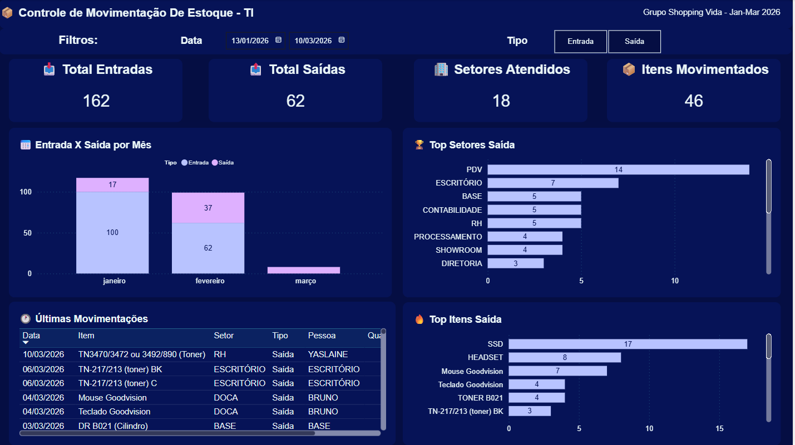

# 📦 Controle de Movimentação de Estoque — TI
 

 
---
 
## 📋 Sobre o Projeto
 
Este projeto nasceu da necessidade de **centralizar e tornar visível** toda a movimentação de equipamentos e suprimentos de TI do **Grupo Shopping Vida**.
 
Antes deste sistema, o controle era feito de forma manual e descentralizada, dificultando respostas rápidas a perguntas como:
- *Quem recebeu determinado equipamento?*
- *Qual setor consome mais suprimentos?*
- *Quantas unidades ainda temos em estoque?*
 
A solução foi construída com ferramentas acessíveis e do dia a dia da equipe: **Google Sheets + Google Apps Script + Power BI**.
 
---
 
## 🎯 Objetivos
 
- Registrar todas as **entradas e saídas** de itens de TI em tempo real
- Manter o **estoque atualizado automaticamente** via fórmulas
- Controlar o **ciclo de vida de toners e cilindros** por equipamento e setor
- Gerar um **dashboard interativo** para tomada de decisão dos gestores
- Enviar **relatórios automáticos por e-mail** sobre status dos suprimentos de impressora
 
---
 
## 🗂️ Estrutura do Repositório
 
```
📁 controle-estoque-ti/
│
├── 📊 Controle_de_Estoque_TI.pbix              # Planilha principal com dados reais
│   ├── Aba: MOVIMENTAÇÕES                       # Registro de todas as entradas e saídas
│   └── Aba: ESTOQUE                             # Posição atual calculada automaticamente
│
├── 📊 Controle_TI.xlsx                          # Relatório Excel com análises consolidadas
│
├── 🖼️ Controle_TI.png                           # Preview do dashboard Power BI
│
└── 📖 README.md                                 # Este arquivo
```
 
---
 
## 🛠️ Tecnologias Utilizadas
 
| Ferramenta | Função |
|---|---|
| **Google Sheets** | Base de dados principal e controle de estoque |
| **Google Apps Script** | Automação: atualização de estoque e envio de e-mails |
| **Power BI Desktop** | Dashboard interativo de análise |
| **Looker Studio** | Dashboard web integrado ao Sheets |
| **Microsoft Excel** | Relatório consolidado para exportação |
 
---
 
## 📊 O Dashboard
 
O dashboard foi desenvolvido no **Power BI** e contém:
 
### 🔢 KPIs Principais
| Indicador | Descrição |
|---|---|
| 📥 Total Entradas | Soma de todos os itens que entraram no estoque |
| 📤 Total Saídas | Soma de todos os itens distribuídos |
| 🏢 Setores Atendidos | Quantidade de setores distintos que receberam itens |
| 📦 Itens Movimentados | Quantidade de itens distintos movimentados |
 
### 📈 Visuais
- **Entrada X Saída por Mês** — Gráfico de barras comparando fluxo mensal
- **🏆 Top Setores Saída** — Ranking dos setores que mais consumiram
- **🔥 Top Itens Saída** — Itens mais distribuídos no período
- **🕐 Últimas Movimentações** — Tabela detalhada com histórico recente
 
### 🔍 Filtros Interativos
- Intervalo de datas
- Tipo (Entrada / Saída)
- Filial (Shopping Vida / ATK - SJM)
 
---
 
## ⚙️ Como Funciona a Automação (Google Apps Script)
 
### — Estoque_Movimentacao
Roda automaticamente ao editar a planilha (`onEdit`):
 
- **Autopreenchimento:** ao digitar um código na aba MOVIMENTAÇÕES, o nome do item é preenchido automaticamente a partir do cadastro de ESTOQUE
- **Processamento de Pedidos:** ao marcar um pedido como `Recebido`, o estoque é atualizado automaticamente com a quantidade recebida
- **Criação automática de itens:** se o código não existir no estoque, o item é criado automaticamente com a categoria correta (Impressora ou Periférico)
 
### — Controle_Impressora
Dispara manualmente ou por gatilho agendado:
 
